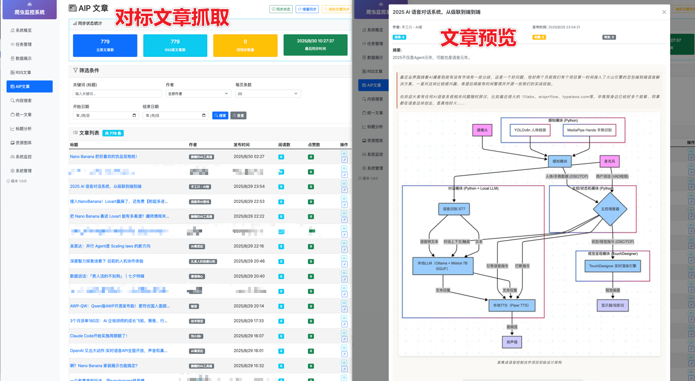
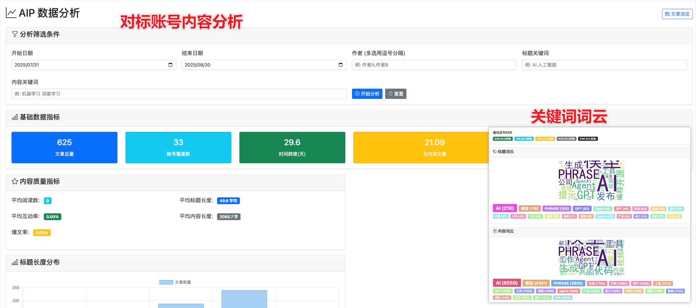
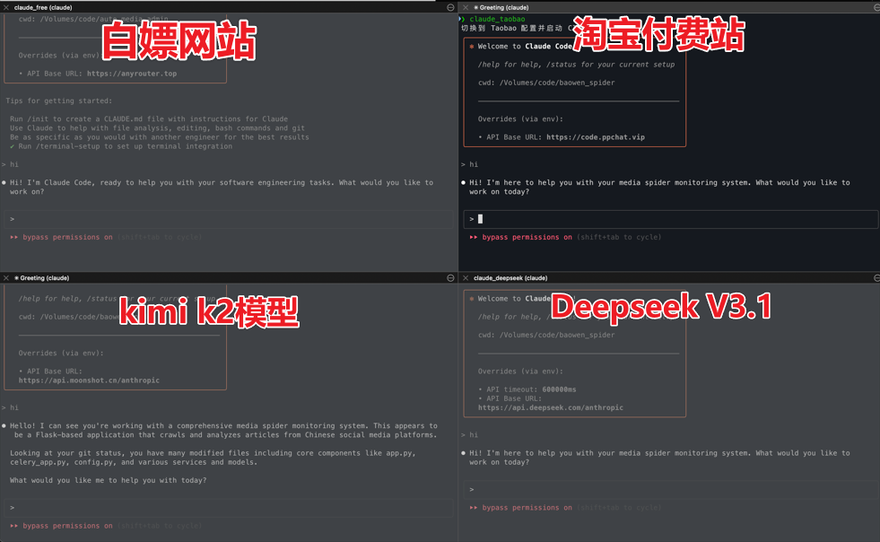

# 70%成本降幅！不装软件混搭Claude Code，我的年省2500元秘籍

用这个方法我把我的cc成本降低了70%

我把成本从3588元/年降到了1196元/年

==================

最近有个问题一直困扰我：我之前白嫖claude code的网站被友商DDos，导致经常用不了。具体来说，一周里只有少数几天能勉强用上，而且即便能用，也常常仅限于其中几个小时，其他时候不是在报500，就是在报500的路上。实在没办法，要找一个新的比较稳定的渠道了。（**由于Anthropic经常封号，想100%稳定是不现实的，只求商家稳定维护就好**）

免费站点本质是爱好者用爱发电，一旦被 Anthropic 风控，整站都会 500，还有友商的DDos攻击；而商家手里握着几十甚至上百个 Claude 账号，通过负载均衡和自动切换把封号风险消化在商家端，所以对我们而言几乎是‘无感’的（**除非封号的规模比较大**）。

之后几天，我逛了好几家淘宝店，看了很多款Claude code接口服务提供商价格基本上都在299元/月到699元/月之间，对于大部分人来说还是太贵了。更何况并不是每天都会用到，但每日积分不会累积，第二天就会重置。对我们这种既需要强大模型能力、又希望成本尽可能低的人来说，299 包月仍然不太划算。

试了好几家店的体验卡之后，终于找到一家合适的：299 元/3 个月，5000 次请求。算下来单次调用成本约 0.06 元。模型效果不错，上周末我还用它开发了几个比较大的功能。虽然中途因为 Anthropic 大规模封号，导致接口一度报 500 错误，但好在我是通过淘宝购买的，风险由服务商承担，而不是我自己。只要服务商处理及时、能快速响应用户问题，我觉得这在国内用 Claude Code 算是比较划算的选择。





不过，虽然服务商在处理问题，但我自己的开发不能停啊。于是我就搞了一套方法，下面就是重点了，大家仔细看。

这个方法的基本思路是：将 Claude Code 的免费接口、付费接口和国产模型配合使用，把稳定和不稳定的接口组合起来，最终实现 24 小时不间断服务。为了省钱，我把需求分为简单和复杂两类：复杂需求（如项目初始化、复杂功能开发）用付费 Claude Code 解决；简单需求则交给国产模型。

# 怎么配置呢？

现在很多人都是使用开源工具 **[claude-code-router](https://github.com/musistudio/claude-code-router)** ，但是我总感觉这个配置起来比较麻烦，特别是模型多的时候，切换模型也总是要多执行一个命令（`/model`）。还需要去学这个工具的命令使用方式，所以我就自己弄了个配置脚本，这个脚本很简单，终端里直接敲 `claude_deepseek` 就能以deepseek模型发起会话（不同的模型只需要换个命令就行：`claude_xxxx`），省去模型选择的二次交互。

**注意：以下步骤需要先安装node和claude code**

安装claude code命令：

```bash
npm install -g @anthropic-ai/claude-code
```

## 第一步： 获取脚本文本

脚本GitHub仓库地址： https://github.com/samelltiger/claude-code-free

> 如果无法打开，你可以在添加微信：ithulianwang 我直接发文件给你
> 
> 或者 在微信公众号后台回复 【claudecodefree】获取文件下载地址

如果能够打开GitHub，那么直接执行如下命令（**拿到文件的不用执行**）：

```bash
git clone https://github.com/samelltiger/claude-code-free
```

## 第二步：修改文件中的Api Key数据

```bash
# 进入目录
cd claude-code-free

# 修改脚本文件的Api Key配置
# 如果不会用vim，用其他文本编辑器或者VScode打开也可以
# 只需要修改最上面的几个api key配置数据，
# 变量名与模型的对应关系可以看第四步的说明
vim ./claude_functions

# 移动文件
cp ./claude_functions ~/.claude_functions
```

## 第三步：配置到终端用户默认导入的配置脚本

为了避免每次打开终端需要手动导入这几个命令，一定要执行这个步骤。

### 先确定你的用的bash还是zsh，再执行对应的命令

**Linux系统一般是 .bashrc，mac系统一般是zsh，windwos推荐使用 wsl子系统（是bashrc）**

**（linux或wsl）对于 Bash (~/.bashrc)：**

```bash
echo '# Load Claude functions' >> ~/.bashrc
echo 'if [ -f ~/.claude_functions ]; then' >> ~/.bashrc
echo '    source ~/.claude_functions' >> ~/.bashrc
echo 'fi' >> ~/.bashrc
```

**（mac系统）对于 Zsh (~/.zshrc)：**

```bash
echo '# Load Claude functions' >> ~/.zshrc
echo 'if [ -f ~/.claude_functions ]; then' >> ~/.zshrc
echo '    source ~/.claude_functions' >> ~/.zshrc
echo 'fi' >> ~/.zshrc
```

**载入配置**：

在完成上面的配置之后，执行下面的命令载入配置

```bash
# linux或者wsl
source ~/.bashrc

# mac os
source ~/.zshrc
```

## 第四步：在终端中打开对应的模型的claude code

打开终端程序（我是mac系统，用的iTerm，可自行安装），切分四个窗口，分别执行如下命令打开对应模型支持的Claude code：

| 命令                | 说明                          | 备注                                                                                                         |
| ----------------- | --------------------------- | ---------------------------------------------------------------------------------------------------------- |
| `claude_free`     | 需配置 `FREE_API_KEY`          | 免费公益站点，注册：[anyrouter.top](https://anyrouter.top)                                                           |
| `claude_kimi`     | 需配置 `KIMI_API_KEY`          | Moonshot Kimi，注册：[moonshot.cn](https://www.moonshot.cn/)                                                   |
| `claude_taobao`   | 需配置 `TAOBAO_API_KEY`        | 淘宝 Claude 接口，可自行寻找 或 联系我获取优惠<br/>**其他的店铺可能需要修改 base_url变量**                                                |
| `claude_deepseek` | 需配置 `DEEPSEEK_API_KEY`      | DeepSeek，注册：[deepseek.com](https://www.deepseek.com/)                                                      |
| `claude_aicode`   | 需配置 `AICODE_MIRROR_API_KEY` | AI Code Mirror，注册：[aicodemirror.com](https://www.aicodemirror.com/register?invitecode=YWJB6R) <br/>（优惠见文末） |
| `claude_start`    | 使用当前配置                      | 需先通过其他命令设置，查看状态：`claude_status`，清除：`claude_clear`                                                          |



本来我还想引入魔塔大模型平台的，他每天免费提供2000次请求，理论上够我们每天白嫖的额度了。但是试了下接口发现给我报错了，我拿到的报错是 `400 tool_calls not supported`，说明魔塔目前只支持 chat completion，还没对齐 Anthropic 的 tool use！如果有能够调通的大佬，还麻烦在评论区赐教一下。

就目前我的使用来看，用这套国内外模型混搭的方案足够我用了。我一般先试试免费公益的claude code中转网站的能不能用，如果不能用就再来判断问题的难易程度，看是用付费的claude还是国产模型，如果claude封号了，中转接口暂时挂了，我会用国产模型，优先使用Deepseek v3.1，kimi k2模型我一般在写作时作为创意写作的辅助模型。

我的需求复杂度判定规则很简单：

1. 需求内容大于100行 或需要多轮迭代 → 算复杂，走付费 Claude；

2. 只是改个函数命名、生成单测、解释报错栈 → 算简单，直接丢给 DeepSeek/Kimi。

Deepseek 的3.1模型在编程方面的确也很强，周末时Claude大封号，我有个需求算是比较复杂的（上下文比较长），然后claude写完有个bug，本来想用claude来修复，但是突然接口就给我报500了，然后我就用deepseek v3.1来修复了一下，然后他一次给我修复成功了，这让我对他的信任度增加了不少。

最后，推荐大家可以尝试一下这套混搭方案，既强大，又省成本！你会爱上它的。

如果文章对你有用，别忘了三连走一波------**点赞、转发、评论**，感谢你的支持～

## 多说一句

最近我用的非常火的国内Claude code服务提供网站 [https://www.aicodemirror.com/](https://www.aicodemirror.com/) ，非常不错，我用它写了不少需求。如果你也在考虑购买Claude code，可以试试这个网站。我这里有个优惠渠道，**售价比官网更优惠**。如果你有需要，欢迎找我咨询。
**微信：ithulianwang**  备注： **claude**  

还能加入AI社群，群内分享：技术讨论｜AI资讯｜围观独立开发日常｜最新产品/工具发布


